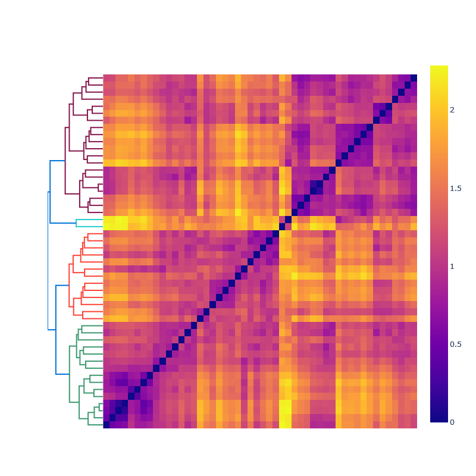

# Hierarchical risk-parity portfolio optimization

A command line applet written in python for hierarchical risk-parity based portfolio optimization.

## Theory

TODO

## Usage

To install, run
```shell
git clone https://github.com/borab96/risk-parity.git
cd risk-parity
pip install .
```

Run ``rpp -h`` for a list of settings that can be specified. The only requirement is the specification of a list of symbols.
The help command returns 
```shell
usage: rpp [-h] [--cash CASH] [--period {1mo,3mo,6mo,1y,2y,5y,10y,ytd,max}]
           [--rebalance REBALANCE] [--save-fig SAVE_FIG] [--leverage LEVERAGE]
           [--short SHORT] [--tune TUNE TUNE TUNE TUNE] [--gamma GAMMA]
           [--cluster CLUSTER] [--browser-output BROWSER]
           list of symbols [list of symbols ...]

Portfolio optimizer.

positional arguments:
  list of symbols       symbols of holdings or equity universe

optional arguments:
  -h, --help            show this help message and exit
  --cash CASH           starting cash
  --period {1mo,3mo,6mo,1y,2y,5y,10y,ytd,max}
                        start date of lookback period
  --rebalance REBALANCE
                        how frequently should the portfolio be rebalanced
  --save-fig SAVE_FIG   If true saves figures in plots dir individually
  --leverage LEVERAGE   Leverage factor. No leverage by default
  --short SHORT         Allow short selling?
  --tune TUNE TUNE TUNE TUNE
                        Run grid search? arg[0]: size of gammas, arg[1:]
                        arguments of np.arange
  --gamma GAMMA         set gamma hyperparameter. gamma=1 is sharpe
                        maximization, gamma=0 is risk parity optimization
  --cluster CLUSTER     If true, does hierarchically clustered optimization
  --browser-output BROWSER
                        If true, displays figures on default browser

...
```

The hyperparameters of the optimization algorithm are ``gamma`` and ``rebalance``. The former
controls the convex combination of risk parity error minimization and Sharpe ratio
maximization and the latter specifies a holding period after which the optimizer is run again. The tuner seeks to 
maximize the Sharpe ratio. The reasoning is that the hyperparameter space represents a space of risk parity optimized 
solutions, at least for ``gamma<1/2`` which should now be ranked by the returns they offer. 

The backtester backfills positions after the optimal weights are computed. The so-called in-sample results assume
knowledge of the future time window. To get out-of-sample results, the positions have to shifted one window to the future
so that the trader positions themself based on the optimizer's result from the past window. Forecasting is not implemented.

``--gamma 1`` runs a Sharpe optimizer while 
``--gamma 0`` runs a risk parity optimizer

The ``--tune`` setting runs a gridsearch to optimize the Sharpe ratio among
optimal solutions. 

The ``--period`` setting sets the backtest period. 

## Example: Sector ETFs

As an example, imagine a portfolio constructed out of S&P 500 sector ETFs. The command
```shell
rpp XLC XLY XLP XLE XLF XLV XLI XLB XLRE XLK XLU --period 2y --tune 20 10 50 5 --cluster False
```
produces the output 

```shell
Optimal allocation of 10000.0
XLC: 0.0
XLY: 1298.4416
XLP: 80.9326
XLE: 616.2989
XLF: 1186.8328
XLV: 1930.6441
XLI: 1265.3073
XLB: 0.0
XLRE: 0.0
XLK: 3621.5429
XLU: 0.0
---------------------------
CAGR 0.238
Average Sharpe ratio 2.385


```

and saves the following 4 plots in the directory ``./plots``:


> The plotting backend has been updated to plotly. The applet now produces a combined [html output](https://htmlpreview.github.io/?https://github.com/borab96/risk-parity/blob/main/plots/combined_sample.html).

 In this case, the hyperparameter tuner chooses ``(gamma, rebalance )`` to be ``(0.37, 15)``
meaning that the optimal portfolio is one that is rebalanced every 15 trading days and one that gives slight preference 
to risk contribution diversification over maximizing the Sharpe ratio. The clustering algorithm is turned off because
our portfolio choice of SPY sectors is already hierarchical in nature. 

## Example: Many correlated assets

The file ``notebooks/top50.txt`` contains a list of the 50 largest US companies at the time it was saved (Jan 2022).
In this case we turn the clustering algorithm on to get more robust optimal portfolios. See [this notebook](https://nbviewer.org/github/borab96/risk-parity/blob/main/notebooks/clustering.ipynb)
for details. The hierarchical structure can be inferred from the plot below



> Because the clustering algorithm learns how to diversify based on correlation hierarchies, we don't really need
to enforce risk parity error minimization here. While not implemented, the optimization metric for each cluster could be chosen
to simply be returns themselves. 

 
