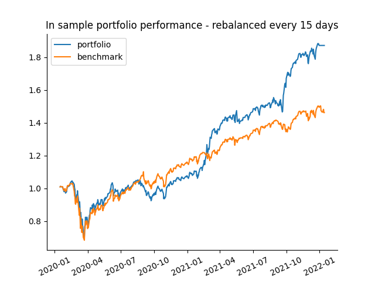
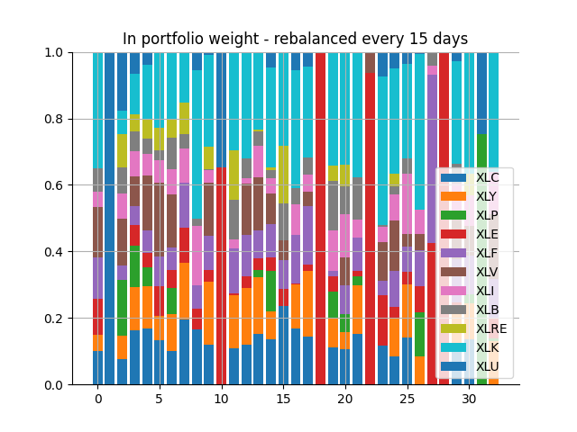
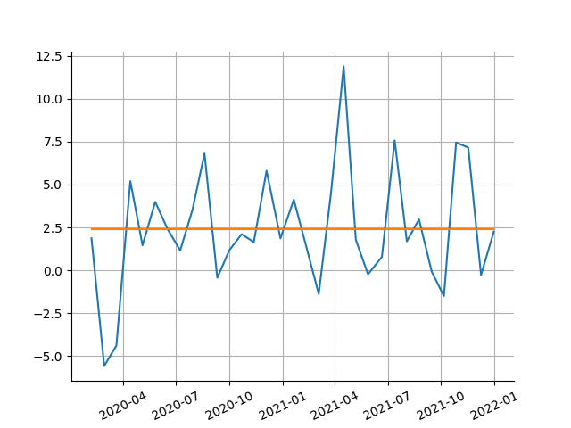
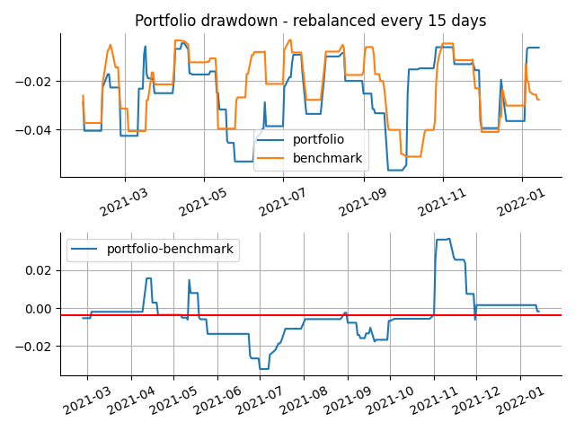

# Risk-parity portfolio optimization

A command line applet written in python for risk-parity based portfolio optimization.

## Theory

## Usage

To install, run
```shell
git clone https://github.com/borab96/risk-parity.git
cd risk-parity
pip install .
```

Run ``rpp -h`` for a list of settings that can be specified. The only requirement is the specification of a list of symbols.
The help command returns 
```shell
rpp [-h] [--cash CASH] [--period {1mo,3mo,6mo,1y,2y,5y,10y,ytd,max}]
           [--rebalance REBALANCE] [--to_pdf TO_PDF] [--leverage LEVERAGE]
           [--short SHORT] [--tune TUNE TUNE TUNE TUNE] [--gamma GAMMA]
           list of symbols [list of symbols ...]
...
```

The hyperparameters of the optimization algorithm are ``gamma`` and ``rebalance``. The former
controls the convex combination of risk parity error minimization and Sharpe ratio
maximization and the latter specifies a holding period after which the optimizer is run again. 

The backtester backfills positions after the optimal weights are computed. The so-called in-sample results assume
knowledge of the future time window. To get out-of-sample results, the positions have to shifted one window to the future
so that the trader positions themself based on the optimizer's result from the past window.

``--gamma 1`` runs a Sharpe optimizer while 
``--gamma 0`` runs a risk parity optimizer

The ``--tune`` setting runs a gridsearch to optimize the Sharpe ratio among
optimal solutions. 

The ``--period`` setting sets the backtest period. I would not recommend going below "2y".

## Example: Sector ETFs

As an example, imagine a portfolio constructed out of S&P 500 sector ETFs. The command
```shell
rpp XLC XLY XLP XLE XLF XLV XLI XLB XLRE XLK XLU --period 2y --tune 20 10 50 5
```
produces the output

```shell
Optimal allocation of 10000.0
XLC: 0.0
XLY: 1298.4416
XLP: 80.9326
XLE: 616.2989
XLF: 1186.8328
XLV: 1930.6441
XLI: 1265.3073
XLB: 0.0
XLRE: 0.0
XLK: 3621.5429
XLU: 0.0
---------------------------
CAGR 0.238
Average Sharpe ratio 2.385


```

and the following 4 plots:






in the directory ``./plots`` In this case, the hyperparameter tuner chooses ``(gamma, rebalance )`` to be ``(0.37, 15)``
meaning that the optimal portfolio is one that is rebalanced every 15 trading days and one that gives slight preference 
to risk contribution diversification over maximizing the Sharpe ratio. 

 
